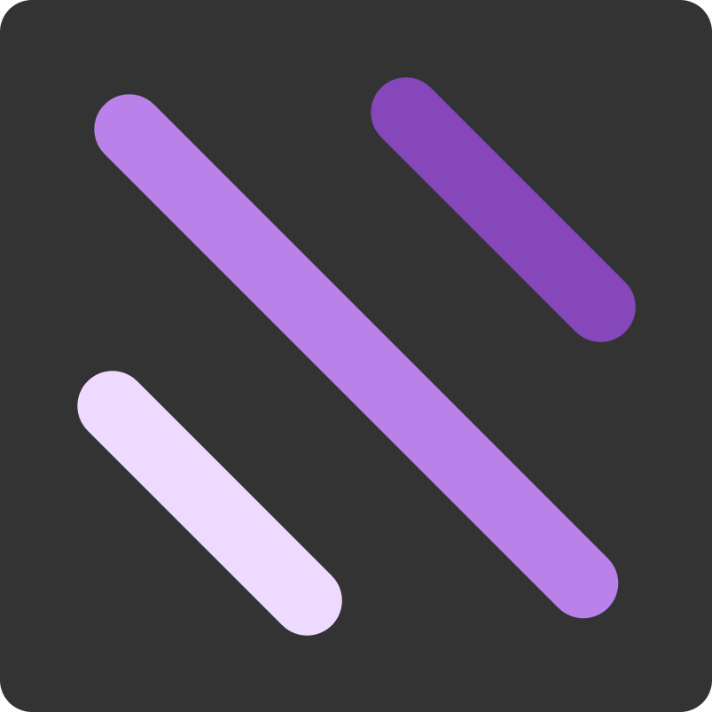

  
  
⭐⭐⭐⭐⭐
 
  <h1 align="center">Starry Sky</h1>
  
Aprendendo um pouco sobre canvas, desenhando um belo de um céu noturno :D

  

    
    
    
    
  

  

      
  

  

  
  <a href="https://github.com/LaksCastro/starry-sky/blob/master/README.md">Read in English</a>

## Mas o que que é isso aqui?
Esse repo é uma [página bem simples](https://lakscastro.github.io/starry-sky) com um canvas em Fullscreen que está dando vida à infinitas de estrelas, gotas de água, ou qualquer coisa que você tenha entendido, no final isso são só linhas mesmo... desenhadas, apagadas e resenhadas novamente.

 
 
 
 

<h2 align="center">
  Open Source
</h2>

  Copyright © 2020-present, Laks Castro.

Starry Sky <a href="https://github.com/LaksCastro/starry-sky/blob/master/LICENSE.md">is MIT licensed 💖</a>

  

