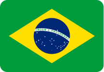

  
  
⭐⭐⭐⭐⭐
 
  <h1 align="center">A Starry Sky</h1>
  
Learning to use canvas drawing a beautiful of a night sky... :D

  

    
    
    
    
  

  

    
  

  

  
  <a href="https://github.com/LaksCastro/starry-sky/blob/master/README-ptbr.md">Ler em português</a>

## But what is this?
It's a very [simple web page](https://lakscastro.github.io/starry-sky), with only a Fullscreen canvas giving life to millions of stars, drops of water, or anything you have understood, in the end it's just lines... drawn, erased and redrawn...

 
 
 
 

<h2 align="center">
  Open Source
</h2>

  Copyright © 2020-present, Laks Castro.

Starry Sky <a href="https://github.com/LaksCastro/starry-sky/blob/master/LICENSE.md">is MIT licensed 💖</a>

  

